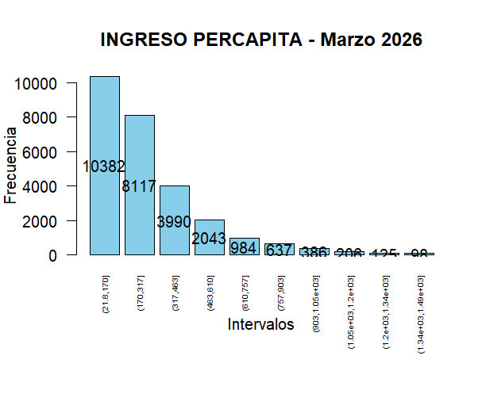
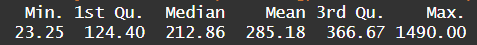
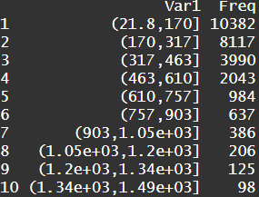

# Ingreso per cápita en Ecuador – Marzo 2026

Análisis exploratorio del ingreso per cápita utilizando datos de la ENEMDU (marzo 2026).

## Metodología
- Limpieza de datos (eliminación de NA)
- Recorte de valores atípicos (percentiles 1–99)
- Análisis descriptivo y distribución de frecuencias

## Resumen estadístico

## Distribución de frecuencias

## Contexto económico

- Línea de pobreza: **$92.40**  
- Línea de pobreza extrema: **$52.07**

## Principales hallazgos

• La distribución del ingreso es asimétrica a la derecha, con fuerte concentración en niveles bajos.
• Una parte importante de la población se encuentra en rangos cercanos a la línea de pobreza.
• Más del 60% de la población se ubica por debajo de ~$317.
• La mediana es menor que la media, evidenciando la influencia de ingresos altos sobre el promedio.

## 🛠️ Herramientas utilizadas
- R
- Análisis exploratorio de datos

